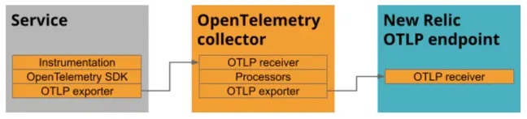

# nginx-ecs-otel-webserver-module
The full example repo showcasing instrumentation collection method of otel-webserver-module on Nginx running in ECS
- ADOT OTEL Collector as a Sidecar

## Install the module for NGINX

In the following repo, you will utilize Docker to set up an NGINX server with the `ngx_http_opentelemetry_module.so` enabled and properly configured. The set of commands provided in the Dockerfile below can also be employed to configure an NGINX server on a bare-metal machine if desired.

Start in the nginx directory 

```Dockerfile
#otel-webserver-module supports both stable(1.22.0) and mainline(1.23.1) for x86-64 platforms.
FROM --platform=amd64 nginx:1.23.1

# Replace the nginx.conf file with our own
COPY nginx.conf /etc/nginx/nginx.conf

# Copy in the Server configuration file
COPY default.conf /etc/nginx/conf.d/default.conf

# Define the version of the NGINX OTel module
# ARG OPENTELEMETRY_CPP_VERSION=1.0.3

# Define the search path for shared libraries used when compiling and running NGINX
ENV LD_LIBRARY_PATH=$LD_LIBRARY_PATH:/opt/opentelemetry-webserver-sdk/sdk_lib/lib

# 1. Download the latest version of Consul template and the OTel C++ web server module, otel-webserver-module
ADD https://github.com/open-telemetry/opentelemetry-cpp-contrib/releases/download/webserver%2Fv${OPENTELEMETRY_CPP_VERSION}/opentelemetry-webserver-sdk-x64-linux.tgz /tmp

RUN apt-get update \
  && apt-get install -y --no-install-recommends dumb-init unzip \
# 2. Extract the module files
  && tar xvfz /tmp/opentelemetry-webserver-sdk-x64-linux.tgz -C /opt \
  && rm -rf /tmp/opentelemetry-webserver-sdk-x64-linux.tgz \
# 3. Install and add the 'load_module' directive at the top of the main NGINX configuration file
  && /opt/opentelemetry-webserver-sdk/install.sh \
  && echo "load_module /opt/opentelemetry-webserver-sdk/WebServerModule/Nginx/1.23.1/ngx_http_opentelemetry_module.so;\n$(cat /etc/nginx/nginx.conf)" > /etc/nginx/nginx.conf

# 4. Copy in the configuration file for the NGINX OTel module
# COPY opentelemetry_module-ADOTcollector.conf /opt/opentelemetry_module.conf
```

What this `Dockerfile` does:

- Pull a base image with NGINX 1.23.1 pre-installed
- Copies a recent build artifact of opentelemetry-webserver-sdk-x64-linux.tgz package supporting `NginxModuleOtelExporterOtlpHeaders`
- Unpack the package, put it into /opt & run ./install.sh
- Add the dependencies at /opt/opentelemetry-webserver-sdk/sdk_lib/lib to the library path (LD_LIBRARY_PATH)
- Tell NGINX to load the ngx_http_opentelemetry_module.so
- Add the configuration of the modules to NGINX.

Next, modify the `opentelemetry_module.conf` according to your use case by default the Dockerfile will build with configuration directives specific to the New Relic OLTP endpoint but you will need to be sure to include your New Relic license key.

```nginx
NginxModuleEnabled ON;
NginxModuleOtelSpanExporter otlp;
NginxModuleOtelExporterEndpoint localhost:4317;
NginxModuleServiceName nginx-proxy;
NginxModuleServiceNamespace nginx;
NginxModuleServiceInstanceId DemoInstanceId;
NginxModuleResolveBackends ON;
NginxModuleTraceAsError ON;
```

You have one choice for exporting data to New Relic via OTLP:

* Export from an OpenTelemetry Collector:



This will enable the OpenTelemetry and apply the following configuration:

- Send spans via OTLP to `localhost:4317`
- Set the attributes `service.name` to `nginx-proxy`, `service.namespace` to
  `nginx` and the `service.instance_id` to `DemoInstanceId`
- Report traces as errors, so you will see them in the NGINX log

To learn all the settings available, see the [full list of directives][].

With the `Dockerfile` and NGINX config in place, build your docker image and run
the container:

```console
$ docker build -t nginx-otelcpp:v1.0 --platform linux/amd64 .
$ docker run --platform linux/amd64 --rm -p 80:80 nginx-otelcpp:v1.0
...

Since the configuration above has `NginxModuleTraceAsError` set to `ON` and you
will see your traces dump to the error log of NGINX:

```log
2022/08/12 09:31:12 [error] 70#70: *3 mod_opentelemetry: startMonitoringRequest: Starting Request Monitoring for: / HTTP/1.1
Host, client: 172.17.0.1, server: localhost, request: "GET / HTTP/1.1", host: "localhost:8080"
2022/08/12 09:31:12 [error] 70#70: *3 mod_opentelemetry: startMonitoringRequest: WebServer Context: DemoServiceNamespaceDemoServiceDemoInstanceId, client: 172.17.0.1, server: localhost, request: "GET / HTTP/1.1", host: "localhost:8080"
2022/08/12 09:31:12 [error] 70#70: *3 mod_opentelemetry: startMonitoringRequest: Request Monitoring begins successfully , client: 172.17.0.1, server: localhost, request: "GET / HTTP/1.1", host: "localhost:8080"
2022/08/12 09:31:12 [error] 70#70: *3 mod_opentelemetry: otel_startInteraction: Starting a new module interaction for: ngx_http_realip_module, client: 172.17.0.1, server: localhost, request: "GET / HTTP/1.1", host: "localhost:8080"
2022/08/12 09:31:12 [error] 70#70: *3 mod_opentelemetry: otel_payload_decorator: Key : tracestate, client: 172.17.0.1, server: localhost, request: "GET / HTTP/1.1", host: "localhost:8080"
2022/08/12 09:31:12 [error] 70#70: *3 mod_opentelemetry: otel_payload_decorator: Value : , client: 172.17.0.1, server: localhost, request: "GET / HTTP/1.1", host: "localhost:8080"
2022/08/12 09:31:12 [error] 70#70: *3 mod_opentelemetry: otel_payload_decorator: Key : baggage, client: 172.17.0.1, server: localhost, request: "GET / HTTP/1.1", host: "localhost:8080"
2022/08/12 09:31:12 [error] 70#70: *3 mod_opentelemetry: otel_payload_decorator: Value : , client: 172.17.0.1, server: localhost, request: "GET / HTTP/1.1", host: "localhost:8080"
2022/08/12 09:31:12 [error] 70#70: *3 mod_opentelemetry: otel_payload_decorator: Key : traceparent, client: 172.17.0.1, server: localhost, request: "GET / HTTP/1.1", host: "localhost:8080"
2022/08/12 09:31:12 [error] 70#70: *3 mod_opentelemetry: otel_payload_decorator: Value : 00-987932d28550c0a1c0a82db380a075a8-fc0bf2248e93dc42-01, client: 172.17.0.1, server: localhost, request: "GET / HTTP/1.1", host: "localhost:8080"
2022/08/12 09:31:12 [error] 70#70: *3 mod_opentelemetry: otel_startInteraction: Interaction begin successful, client: 172.17.0.1, server: localhost, request: "GET / HTTP/1.1", host: "localhost:8080"
2022/08/12 09:31:12 [error] 70#70: *3 mod_opentelemetry: otel_stopInteraction: Stopping the Interaction for: ngx_http_realip_module, client: 172.17.0.1, server: localhost, request: "GET / HTTP/1.1", host: "localhost:8080"
```
